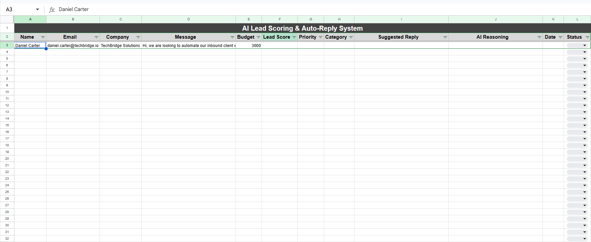
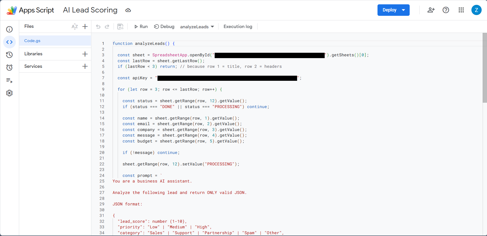

# AI Lead Scoring & Auto-Reply System

## Status

Working prototype — designed as a portfolio project demonstrating practical AI workflow automation for real-world business use cases.

This project showcases structured LLM integration, automated lead qualification logic, spreadsheet-based workflow orchestration, and controlled state processing.

---

## Overview

This system automates inbound lead qualification using:

- Google Sheets  
- Google Apps Script  
- LLM API (OpenAI-compatible endpoint)

The automation:

- Analyzes incoming leads  
- Scores buying intent (1–10)  
- Assigns priority (Low / Medium / High)  
- Categorizes the inquiry  
- Generates a professional suggested reply  
- Writes structured output back into the spreadsheet  
- Tracks processing status and timestamps  

The goal is to reduce manual review time and improve response prioritization.

---

## Problem It Solves

Businesses frequently receive inbound messages that must be:

- Manually reviewed  
- Categorized  
- Prioritized  
- Replied to individually  

This repetitive process slows response time and increases the risk of missing high-intent leads.

This system automates that workflow using structured AI analysis.

---

## How It Works

1. Leads are submitted into a Google Sheet.
2. The Apps Script scans for rows without a completed status.
3. A structured AI prompt is dynamically constructed.
4. Lead data is sent to an LLM API.
5. The model returns structured JSON output.
6. The script safely extracts and parses the JSON.
7. The spreadsheet is updated with:
   - Lead score
   - Priority level
   - Category
   - Suggested reply
   - Reasoning
   - Timestamp
   - Status (PROCESSING / DONE / ERROR)

To maintain stability and avoid rate-limit issues, the system processes one lead per execution cycle.

---

## Architecture Flow

User Input (Google Sheet)  
→ Apps Script Trigger  
→ Prompt Construction  
→ LLM API Call  
→ JSON Response Parsing  
→ Structured Data Written Back to Sheet  
→ Workflow Status Updated  

---

## Core Features

- Automated lead scoring (1–10 scale)
- Priority classification (Low / Medium / High)
- Inquiry categorization (Sales, Support, Partnership, Spam, Other)
- AI-generated professional reply suggestions
- Structured JSON extraction from LLM response
- Status-based workflow control (PROCESSING / DONE / ERROR)
- Timestamp logging for processed leads
- Basic parsing error handling

---

## Technologies Used

- Google Sheets
- Google Apps Script (JavaScript runtime)
- LLM API (OpenAI-compatible endpoint)
- JSON parsing and structured outputs
- Prompt engineering
- Workflow state management logic
- HTTP API integration (UrlFetchApp)

---

## Example Input
{
  "name": "John Smith",
  "email": "john@company.com",
  "company": "TechCorp",
  "budget": "$5,000",
  "message": "We are interested in automating our inbound customer requests and would like to know pricing and timeline."
}

---

## Example Output
{
  "lead_score": 9,
  "priority": "High",
  "category": "Sales",
  "reasoning": "Clear buying intent with defined budget and project scope.",
  "suggested_reply": "Thank you for your inquiry. We'd be happy to discuss how we can automate your inbound requests. Could we schedule a short call this week?"
}

---

## Security Notice

API keys must never be hardcoded in production environments.

In production, environment-based key storage should be used (e.g., Apps Script PropertiesService).

---

## Future Improvements

- Retry logic for failed API calls
- Rate-limit handling
- Python (FastAPI) backend version
- Database integration
- Webhook-based triggers
- Multi-model support
- Logging dashboard
- Cost tracking per processed lead

---

## Purpose of This Project

This repository demonstrates:

- Practical AI integration into real-world business workflows
- Structured LLM response handling and validation
- Spreadsheet-based automation architecture
- End-to-end API communication with state control
- System design thinking applied to workflow automation

Built as a portfolio-ready AI workflow automation project.

---

## Screenshots

### Input (Raw Leads in Google Sheets)

### Output (AI-Processed Lead with Score & Reply)

### Apps Script Logic

